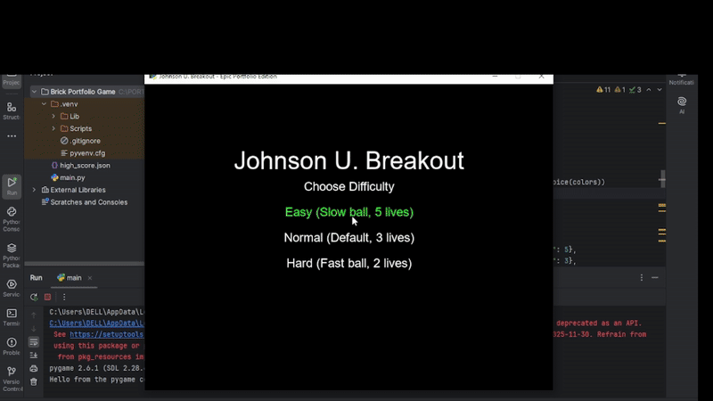

# Johnson U. Breakout

A modern Python remake of the classic Breakout game using Pygame, built and branded as Johnson U. Breakout. Destroy bricks with a ball and paddle, collect power-ups, and challenge yourself across multiple levels and difficulty settings.

---

## Features

- Difficulty Settings: Easy, Normal, Hard (user-selectable, highlighted in green)
- Multi-Level Gameplay: Each level adds more bricks for increasing challenge
- Power-Ups:
  - Extra life
  - Paddle enlarge/shrink
  - Slow ball
  - Multi-ball
- Dynamic Background: Floating particles for visual polish
- Score & High Score: Tracks score and saves high score in JSON for persistence
- Embedded Sounds: Paddle hit and brick hit effects generated internally (no external files)
- User-Friendly Controls:
  - Arrow keys for paddle movement
  - Pause/resume with P
  - Game Over screen with replay option

---

## Installation

1. Make sure you have Python 3.x installed.
2. Install Pygame:
   `bash
   pip install pygame

3. Clone this repository:

git clone https://github.com/johnnie416/JohnsonU_Breakout-Game.git

4. Navigate into the folder and run the game:

cd JohnsonU_Breakout
python main.py

---

Controls

Left Arrow / Right Arrow: Move paddle

P: Pause / Resume game

Enter: Restart game on Game Over

Escape: Quit game

---

How It Works

Paddle: Controlled by the player, moves horizontally, interacts with ball.

Ball: Bounces off walls, paddle, and bricks; triggers scoring and power-ups.

Bricks: Destroyed on collision with ball; points awarded per brick.

Power-Ups: Randomly dropped from bricks; provide gameplay advantages or challenges.

Particles: Floating in background for dynamic visual effect.

Sounds: Play on collisions for an interactive experience.

Difficulty Selection: Adjusts ball speed and starting lives for challenge.

---

Portfolio Highlights

Full object-oriented Python design with multiple classes: Paddle, Ball, Brick, PowerUp, Particle.

Uses sprite groups for efficient collision detection and updates.

Embedded sound generation demonstrates advanced Python techniques.

Dynamic visual effects make the game polished and professional.

Persistent high score shows ability to handle file I/O in Python.

---

Credits

Original Breakout concept by Steve Wozniak.

Game built, enhanced, and branded as Johnson U. Breakout.